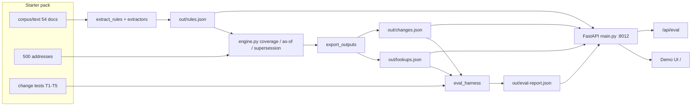

# LeaseLaw OPS runbook

**Audience:** Claude / Cursor / OpenCode / ZCode / Gemini / Copilot / future tools.  
**Start here after** [`AGENTS.md`](../AGENTS.md). Live board: [`WIN_BOARD.md`](WIN_BOARD.md). Snapshot: [`STATUS.md`](STATUS.md).

**Canonical repo:** `/Users/efi/Hackathons/Hackathon-Idea-Search`  
**Product:** `apps/leaselaw/` · Hack-Nation 7 · Track **02 RealPage**  
**Disclaimer:** Not legal advice (must stay on UI + API).

---

## 1. What “green” means

| Check | Command / URL | Expect |
|-------|---------------|--------|
| Harness | `cd apps/leaselaw && python3 -m src.eval_harness` | `passed` 5/5, exit 0 → writes `out/eval-report.json` |
| Export | `python3 -m src.export_outputs` | refreshes `out/rules.json`, `lookups.json`, `changes.json` |
| Health | `curl -s http://127.0.0.1:8012/health` | `"ok": true`, ~500 addresses, rules count |
| Eval API | `curl -s http://127.0.0.1:8012/api/eval` | `"passed": 5`, `"total": 5` |
| UI | http://127.0.0.1:8012 | “Not legal advice” + judge score panel |

Prefer `python3` on this machine (`python` may be missing).

---

## 2. Ports & endpoints

| Item | Value |
|------|-------|
| Demo / API port | **8012** (do not silently change) |
| Local base | `http://127.0.0.1:8012` |
| Host bind (local) | `127.0.0.1` |
| Host bind (Docker/public) | `0.0.0.0` |

| Path | Role |
|------|------|
| `GET /` | Demo HTML (lookup + as-of + score panel) |
| `GET /health` | Liveness + pack summary |
| `GET /api/eval` | T1–T5 report JSON (panel polls this) |
| `GET /api/lookup` | Address → applicable rules |
| `GET /api/compare` | As-of comparison |
| `GET /api/addresses` | Address list |
| `GET /api/change-tests` | Change-test metadata |

Proxy the app at **domain root** (not `/leaselaw/`). The UI uses absolute `fetch('/api/eval')`.

---

## 3. Architecture / dataflow



**Mental model:** corpus → extract → rules → engine → lookups/changes → API/UI → eval.

| Stage | Module | Output |
|-------|--------|--------|
| Paths / pack | `src/paths.py` | `LEASELAW_STARTER` or default under `briefs/...` |
| Load | `src/data.py` | addresses, corpus, rules |
| Jurisdiction | `src/jurisdiction.py` | `legal_city` (e.g. Boston neighborhoods) |
| Extract | `src/extract_rules.py` + `src/extractors/**` | rule objects |
| Engine | `src/engine.py` | applies / pending / not_yet / superseded |
| Export | `src/export_outputs.py` | `out/rules|lookups|changes.json` |
| Eval | `src/eval_harness.py` | `out/eval-report.json` |
| Serve | `src/main.py` | UI + APIs |

---

## 4. Artifacts (on disk)

Under `apps/leaselaw/out/`:

| File | Purpose |
|------|---------|
| `rules.json` | Extracted rules (schema-shaped) |
| `lookups.json` | Per-address applicability (large) |
| `changes.json` | T1–T5-oriented change rows |
| `eval-report.json` | Harness result consumed by `/api/eval` |

Starter pack (required for extract/export/eval from scratch):

```
briefs/hack-nation-7-realpage-starter/participant-final-no-hour16 3/
```

Override: `export LEASELAW_STARTER=/path/to/pack`.  
This pack is **participant-no-scoring** — no official `score.py`.

---

## 5. Day-one commands

```bash
cd /Users/efi/Hackathons/Hackathon-Idea-Search/apps/leaselaw
python3 -m venv .venv && source .venv/bin/activate   # if needed
pip install -r requirements.txt

python3 -m src.extract_rules      # after extractor / corpus changes
python3 -m src.export_outputs
python3 -m src.eval_harness       # must stay 5/5

uvicorn src.main:app --host 127.0.0.1 --port 8012
# optional reload: uvicorn src.main:app --reload --host 127.0.0.1 --port 8012
```

Do **not** re-extract blindly if only polishing UI — keep harness green after any rule/engine change.

---

## 6. Multi-agent ownership

| Agent | Owns | Do not touch unless `HANDOFF:` |
|-------|------|--------------------------------|
| **Cursor** | `extract_rules.py`, `engine.py`, `eval_harness.py`, integrate/unblock | — |
| **OpenCode** | `src/extractors/**`, UI polish when board says so | Cursor core modules |
| **ZCode** | Durable deploy, `apps/leaselaw/deploy/`, `docs/hn7-submission-pack/` | Core extract/engine |
| **All** | `docs/WIN_BOARD.md`, `docs/AGENT_ADVICE_LOG.md` (append) | — |

**Protocol**

1. Before coding: `WIN_BOARD.md` + last ~20 lines of `AGENT_ADVICE_LOG.md`.
2. After a meaningful step: append advice for other agents.
3. Update WIN_BOARD Status checkboxes when gates change.
4. Claims discipline: measure before saying done / live / deployed.

Pointers: [`opencode-win-prompt.txt`](opencode-win-prompt.txt) · [`zcode-build-goal.md`](zcode-build-goal.md) · [`apps/leaselaw/AGENTS.md`](../apps/leaselaw/AGENTS.md).

---

## 7. Deploy notes (ZCode)

Details: [`apps/leaselaw/deploy/README.md`](../apps/leaselaw/deploy/README.md).

| Option | Notes |
|--------|-------|
| Cloudflare quick tunnel | `npx cloudflared tunnel --url http://127.0.0.1:8012` — ephemeral; dies with laptop |
| Docker | `apps/leaselaw/Dockerfile` · map host `$PORT` → 8012 if needed · bundle or build `out/*.json` |
| Durable host | Prefer named tunnel / Fly / Render / container — paste URL into `docs/hn7-submission-pack/LIVE_URL.txt` |

After deploy: `curl` public `/health` and `/api/eval` (`passed=5`) before trusting the live URL.

---

## 8. Human-only actions

**Never do these unless the human explicitly asks in writing:**

- HackOS / challenge submit
- Google Form submit
- Email final send
- `git push` / production DNS cutover
- Video upload to judge platforms

Agents may draft copy under `docs/hn7-submission-pack/` and keep `LIVE_URL.txt` accurate.

---

## 9. Troubleshooting

### uvicorn dead / connection refused on 8012

```bash
cd apps/leaselaw
# see if something listens
lsof -iTCP:8012 -sTCP:LISTEN || true
uvicorn src.main:app --host 127.0.0.1 --port 8012
curl -s http://127.0.0.1:8012/health
```

Logs (if used): `apps/leaselaw/logs/uvicorn.log`.

### Tunnel URL 502 / dead

Quick tunnels die when the laptop sleeps or the `cloudflared` process exits. Restart uvicorn **then** tunnel; update `LIVE_URL.txt`. Prefer durable deploy for judges.

### Starter pack missing

```
FileNotFoundError: RealPage starter not found at ...
```

Unpack the Drive zip into `briefs/hack-nation-7-realpage-starter/` so the folder `participant-final-no-hour16 3/` exists (space + trailing `3` in the name). Or set `LEASELAW_STARTER`.

### Eval not 5/5

1. Re-run: `python3 -m src.export_outputs && python3 -m src.eval_harness`
2. Read failing `test_id` in stdout / `out/eval-report.json`
3. Common causes:
   - **T1** AB325 as-of / CA applicability broken in engine or dates
   - **T2** Hoboken vs Jersey City boundary
   - **T3** NJ FAIR Act coverage
   - **T4** MA pending bills
   - **T5** failed MA rent ballot showing as a rent cap that `applies` (must be 0 hits)
4. Do not “fix” by deleting tests. Fix extractors/engine; keep quoted spans real when possible.

### Score panel says “run the harness”

`out/eval-report.json` missing or stale. Run `python3 -m src.eval_harness` and reload `/`.

### Wrong workspace

Ignore `/Users/efi/Hackathons/Hack Nation` (empty pointer). Work only in this repo.

---

## 10. Hard rules (ops-relevant)

1. Keep **Not legal advice** on UI and API responses.
2. Prefer real `quoted_span` substrings from corpus.
3. Struck/failed laws must not appear as applying rent caps.
4. No secrets in commits · no `--no-verify` · no force-push.
5. Small diffs; do not rewrite HackForge unless the task is HackForge.

---

## 11. Doc map (avoid sprawl)

| Doc | Role |
|-----|------|
| [`AGENTS.md`](../AGENTS.md) | Contract for every AI |
| This file | How to operate day-to-day |
| [`STATUS.md`](STATUS.md) | Machine-readable snapshot |
| [`WIN_BOARD.md`](WIN_BOARD.md) | Gate status + ownership |
| [`AGENT_ADVICE_LOG.md`](AGENT_ADVICE_LOG.md) | Append-only cross-agent notes |
| [`CLAUDE.md`](../CLAUDE.md) / [`GEMINI.md`](../GEMINI.md) | Thin IDE entrypoints → AGENTS + this runbook |
